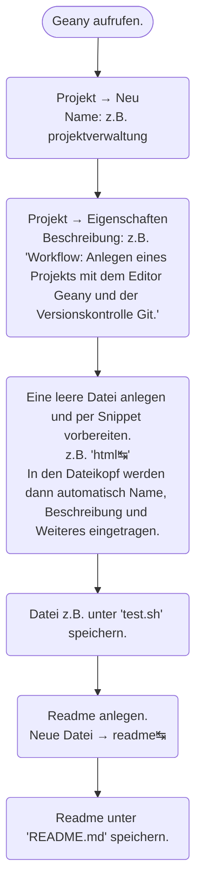
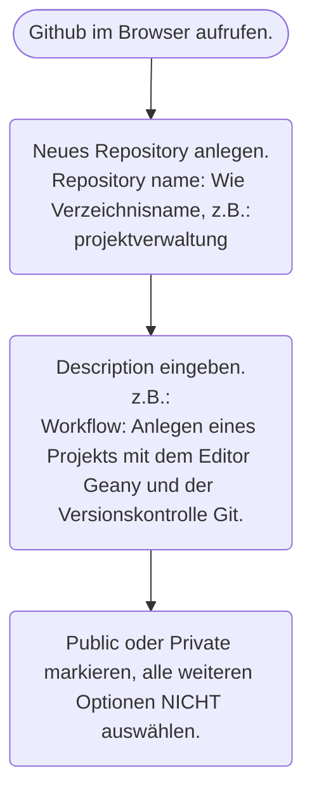
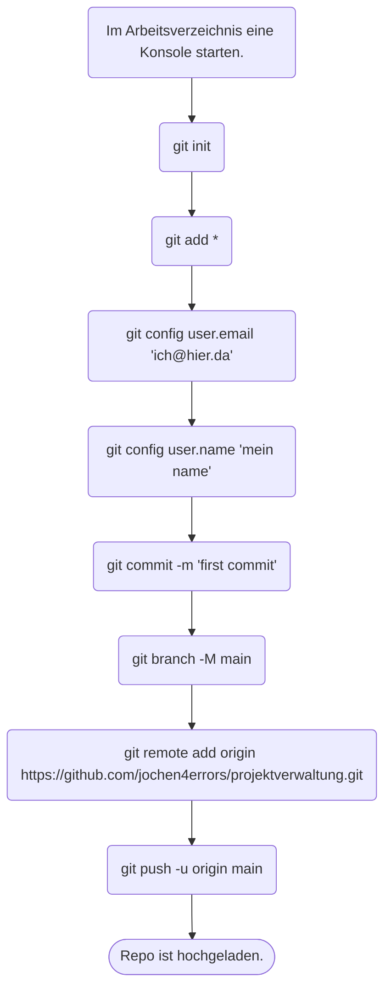
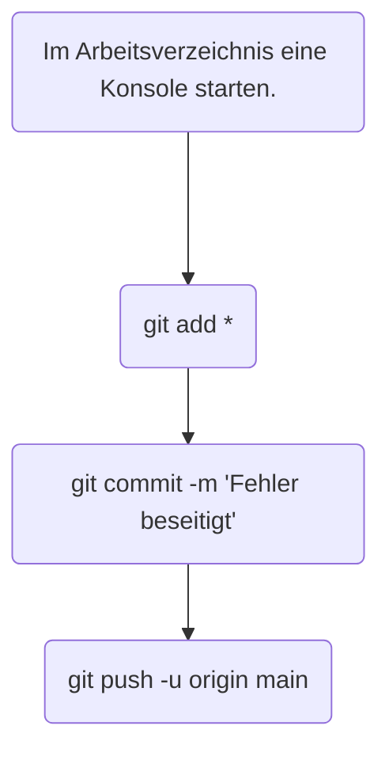

# Workflow Repo anlegen

## 1. Geany

```mermaid
flowchart TB;
Geany([Geany aufrufen.])
-->
ProjektAnlegen("Projekt → Neu\nName: z.B. projektverwaltung")
-->
ProjektEinstellen("Projekt → Eigenschaften\nBeschreibung: z.B. 'Workflow: Anlegen eines Projekts mit dem Editor Geany und der Versionskontrolle Git.'")
-->
NeueDateiAnlegen("Eine leere Datei anlegen und per Snippet vorbereiten.\nz.B. 'html↹'\nIn den Dateikopf werden dann automatisch Name, Beschreibung und Weiteres eingetragen.")
-->
DateiSpeichern("Datei z.B. unter 'test.sh' speichern.")
-->
ReadmeAnlegen("Readme anlegen.\nNeue Datei → readme↹")
-->
ReadmeSpeichern("Readme unter 'README.md' speichern.")
```

## 2. Github

```mermaid
flowchart TB;
Github([Github im Browser aufrufen.])
-->
NeuesRepo("Neues Repository anlegen.\nRepository name: Wie Verzeichnisname, z.B.:\nprojektverwaltung")
-->
Description(Description eingeben.\nz.B.:\nWorkflow: Anlegen eines Projekts mit dem Editor Geany und der Versionskontrolle Git.)
-->
GitEinstellungen(Public oder Private markieren, alle weiteren Optionen NICHT auswählen.)
```

## 3. Konsole

```mermaid
flowchart TB
Arbeitsverzeichnis(Im Arbeitsverzeichnis eine Konsole starten.)
-->
gitinit(git init)
-->
gitadd(git add *)
-->
usermail("git config user.email 'ich@hier.da'")
-->
username("git config user.name 'mein name'")
-->
commit("git commit -m 'first commit'")
-->
branch("git branch -M main")
-->
remote("git remote add origin https://github.com/jochen4errors/projektverwaltung.git")
-->
push("git push -u origin main")
-->Ende([Repo ist hochgeladen.])
```

# Workflow Änderungen

```mermaid
flowchart TB
Arbeitsverzeichnis(Im Arbeitsverzeichnis eine Konsole starten.)
--->
add(git add *)
-->
commit("git commit -m 'Fehler beseitigt'")
-->
push("git push -u origin main")
```